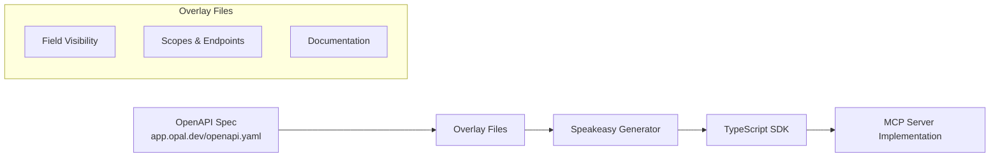

# opal-mcp

Developer-friendly & type-safe Typescript SDK specifically catered to leverage *opal-mcp* API.

<div align="left">
    <a href="https://www.speakeasy.com/?utm_source=opal-mcp&utm_campaign=typescript"></a>
    <a href="https://opensource.org/licenses/MIT">
        
    </a>
</div>

<!-- Start Summary [summary] -->
## Summary

Opal API: The Opal API is a RESTful API that allows you to interact with the Opal Security platform programmatically.

The MCP (Model Context Protocol) server is a standardized way for AI systems to interact with external tools and services. This opal-mcp package provides a fully-featured MCP server implementation that allows AI assistants like Claude, GitHub Copilot, and other LLM-based tools to securely interact with the Opal Security platform. With this MCP server, AI assistants can:

- Retrieve information about users, groups, resources, and access policies
- Create and manage access requests
- Automate identity and access management workflows

For example, you can ask an AI assistant connected to this MCP server to:

```
"Show me all users in the Engineering group"
"Create an access request for the Production database"
"Review the recent access changes for our AWS resources"
"Get information about which users have access to the financial reporting resources"
```

The AI assistant will use the appropriate SDK functions through the MCP server to retrieve or modify data in your Opal environment, making it easy to manage access control through natural language conversations.<!-- End Summary [summary] -->

<!-- Start Table of Contents [toc] -->
## Table of Contents
<!-- $toc-max-depth=2 -->

* [opal-mcp](#opal-mcp)
  * [SDK Installation](#sdk-installation)
  * [Requirements](#requirements)
  * [SDK Example Usage](#sdk-example-usage)
  * [Authentication](#authentication)
  * [Available Resources and Operations](#available-resources-and-operations)
  * [Standalone functions](#standalone-functions)
  * [Retries](#retries)
  * [Error Handling](#error-handling)
  * [Server Selection](#server-selection)
  * [Custom HTTP Client](#custom-http-client)
  * [Debugging](#debugging)
  * [Development](#development)
  * [Maturity](#maturity)
  * [Contributions](#contributions)
  * [Architecture Overview](#architecture-overview)
  * [OpenAPI to SDK Generation](#openapi-to-sdk-generation)
  * [Using the Generated SDK](#using-the-generated-sdk)
  * [Documentation](#documentation)
  * [Contributing](#contributing)

<!-- End Table of Contents [toc] -->

<!-- Start SDK Installation [installation] -->
## SDK Installation

The SDK can be installed with either [npm](https://www.npmjs.com/), [pnpm](https://pnpm.io/), [bun](https://bun.sh/) or [yarn](https://classic.yarnpkg.com/en/) package managers.

### NPM

```bash
npm add opal-mcp
```

### PNPM

```bash
pnpm add opal-mcp
```

### Bun

```bash
bun add opal-mcp
```

### Yarn

```bash
yarn add opal-mcp zod

# Note that Yarn does not install peer dependencies automatically. You will need
# to install zod as shown above.
```

### Generating an API Key

To authenticate with the Opal API, you'll need to generate an API token:

1. Log in to the Opal dashboard as an Admin
2. Navigate to the **Settings** page
3. Select the API Tokens section
4. Click "Generate new token"
5. Choose the appropriate access level:
   - **Read-only**: For applications that only need to view resources
   - **Full-access**: For applications that need to create or modify resources
6. Set an expiration date (optional but recommended for security)
7. Add a descriptive label to identify the token's purpose
8. Save the token securely - it will only be displayed once

If a token is compromised, you can revoke it at any time from the Opal Admin page.

For more information, see the [Opal API Authentication Documentation](https://docs.opal.dev/reference/authentication).

> [!NOTE]
> This package is published with CommonJS and ES Modules (ESM) support.


### Model Context Protocol (MCP) Server

This SDK is also an installable MCP server where the various SDK methods are
exposed as tools that can be invoked by AI applications.

> Node.js v20 or greater is required to run the MCP server from npm.

<details>
<summary>Claude installation steps</summary>

Add the following server definition to your `claude_desktop_config.json` file:

```json
{
  "mcpServers": {
    "OpalMcp": {
      "command": "npx",
      "args": [
        "-y", "--package", "opal-mcp",
        "--",
        "mcp", "start",
        "--bearer-auth", "..."
      ]
    }
  }
}
```

</details>

<details>
<summary>Cursor installation steps</summary>

Create a `.cursor/mcp.json` file in your project root with the following content:

```json
{
  "mcpServers": {
    "OpalMcp": {
      "command": "npx",
      "args": [
        "-y", "--package", "opal-mcp",
        "--",
        "mcp", "start",
        "--bearer-auth", "..."
      ]
    }
  }
}
```

</details>

You can also run MCP servers as a standalone binary with no additional dependencies. You must pull these binaries from available Github releases:

```bash
curl -L -o mcp-server \
    https://github.com/{org}/{repo}/releases/download/{tag}/mcp-server-bun-darwin-arm64 && \
chmod +x mcp-server
```

If the repo is a private repo you must add your Github PAT to download a release `-H "Authorization: Bearer {GITHUB_PAT}"`.


```json
{
  "mcpServers": {
    "Todos": {
      "command": "./DOWNLOAD/PATH/mcp-server",
      "args": [
        "start"
      ]
    }
  }
}
```

For a full list of server arguments, run:

```sh
npx -y --package opal-mcp -- mcp start --help
```

### Running the MCP Server with Docker

The SDK includes a Dockerfile and docker-compose.yaml for easy containerization and deployment.

#### Using docker-compose

1. Create a `.env` file with your configuration:
   ```
   BEARER_AUTH=your_api_key_here
   PORT=32000
   SERVER_URL=https://api.opal.dev/v1
   LOG_LEVEL=info
   ```

2. Run the server using docker-compose:
   ```bash
   docker-compose up -d
   ```

3. Configure your MCP client to connect to the server by adding the following to your configuration file:
   ```json
   {
     "mcpServers": {
       "opal-mcp": {
         "url": "http://localhost:32000/sse",
         "env": {
           "API_KEY": "your_api_key_here"
         }
       }
     }
   }
   ```

#### Building and running manually

You can also build and run the Docker image directly:

```bash
# Build the image
docker build -t opal-mcp-server .

# Run the container
docker run -p 32000:32000 -e BEARER_AUTH=your_api_key_here opal-mcp-server
```
<!-- End SDK Installation [installation] -->

<!-- Start Requirements [requirements] -->
## Requirements

For supported JavaScript runtimes, please consult [RUNTIMES.md](RUNTIMES.md).
<!-- End Requirements [requirements] -->

<!-- Start SDK Example Usage [usage] -->
## SDK Example Usage

### Example

```typescript
import { OpalMcp } from "opal-mcp";

const opalMcp = new OpalMcp({
  bearerAuth: process.env["OPALMCP_BEARER_AUTH"] ?? "",
});

async function run() {
  const result = await opalMcp.apps.getApps({
    appTypeFilter: [
      "OKTA_DIRECTORY",
      "GIT_HUB",
    ],
    ownerFilter: "29827fb8-f2dd-4e80-9576-28e31e9934ac",
  });

  // Handle the result
  console.log(result);
}

run();

```
<!-- End SDK Example Usage [usage] -->

<!-- Start Authentication [security] -->
## Authentication

### Per-Client Security Schemes

This SDK supports the following security scheme globally:

| Name         | Type | Scheme      | Environment Variable  |
| ------------ | ---- | ----------- | --------------------- |
| `bearerAuth` | http | HTTP Bearer | `OPALMCP_BEARER_AUTH` |

To authenticate with the API the `bearerAuth` parameter must be set when initializing the SDK client instance. For example:
```typescript
import { OpalMcp } from "opal-mcp";

const opalMcp = new OpalMcp({
  bearerAuth: process.env["OPALMCP_BEARER_AUTH"] ?? "",
});

async function run() {
  const result = await opalMcp.apps.getApps({
    appTypeFilter: [
      "OKTA_DIRECTORY",
      "GIT_HUB",
    ],
    ownerFilter: "29827fb8-f2dd-4e80-9576-28e31e9934ac",
  });

  // Handle the result
  console.log(result);
}

run();

```
<!-- End Authentication [security] -->

<!-- Start Available Resources and Operations [operations] -->
## Available Resources and Operations

<details open>
<summary>Available methods</summary>

### [accessRules](docs/sdks/accessrules/README.md)

* [createAccessRule](docs/sdks/accessrules/README.md#createaccessrule) - Creates a new access rule config for the given group_id.
* [getAccessRule](docs/sdks/accessrules/README.md#getaccessrule) - Returns a list of access rule config given the group_id of the access rule.
* [updateAccessRule](docs/sdks/accessrules/README.md#updateaccessrule) - Updates the access rule config for the given group_id.

### [apps](docs/sdks/apps/README.md)

* [getApps](docs/sdks/apps/README.md#getapps) - Returns a list of `App` objects.
* [getApp](docs/sdks/apps/README.md#getapp) - Returns an `App` object.
* [getSyncErrors](docs/sdks/apps/README.md#getsyncerrors) - Returns a list of recent sync errors that have occurred since the last successful sync.

### [bundles](docs/sdks/bundles/README.md)

* [getBundles](docs/sdks/bundles/README.md#getbundles) - Returns a list of `Bundle` objects.
* [createBundle](docs/sdks/bundles/README.md#createbundle) - Creates a bundle.
* [getBundle](docs/sdks/bundles/README.md#getbundle) - Returns a `Bundle` object.
* [deleteBundle](docs/sdks/bundles/README.md#deletebundle) - Deletes a bundle.
* [updateBundle](docs/sdks/bundles/README.md#updatebundle) - Updates a bundle.
* [getBundleResources](docs/sdks/bundles/README.md#getbundleresources) - Returns a list of `Resource` objects in a given bundle.
* [addBundleResource](docs/sdks/bundles/README.md#addbundleresource) - Adds a resource to a bundle.
* [removeBundleResource](docs/sdks/bundles/README.md#removebundleresource) - Removes a resource from a bundle.
* [getBundleGroups](docs/sdks/bundles/README.md#getbundlegroups) - Returns a list of `Group` objects in a given bundle.
* [addBundleGroup](docs/sdks/bundles/README.md#addbundlegroup) - Adds a group to a bundle.
* [removeBundleGroup](docs/sdks/bundles/README.md#removebundlegroup) - Removes a group from a bundle.
* [getBundleVisibility](docs/sdks/bundles/README.md#getbundlevisibility) - Gets the visibility of the bundle.
* [setBundleVisibility](docs/sdks/bundles/README.md#setbundlevisibility) - Sets the visibility of the bundle.

### [configurationTemplates](docs/sdks/configurationtemplates/README.md)

* [getConfigurationTemplates](docs/sdks/configurationtemplates/README.md#getconfigurationtemplates) - Returns a list of `ConfigurationTemplate` objects.
* [createConfigurationTemplate](docs/sdks/configurationtemplates/README.md#createconfigurationtemplate) - Creates a configuration template.
* [updateConfigurationTemplate](docs/sdks/configurationtemplates/README.md#updateconfigurationtemplate) - Update a configuration template.
* [deleteConfigurationTemplate](docs/sdks/configurationtemplates/README.md#deleteconfigurationtemplate) - Deletes a configuration template.

### [events](docs/sdks/events/README.md)

* [events](docs/sdks/events/README.md#events) - Returns a list of `Event` objects.

### [groupBindings](docs/sdks/groupbindings/README.md)

* [getGroupBindings](docs/sdks/groupbindings/README.md#getgroupbindings) - Returns a list of `GroupBinding` objects.
* [createGroupBinding](docs/sdks/groupbindings/README.md#creategroupbinding) - Creates a group binding.
* [updateGroupBindings](docs/sdks/groupbindings/README.md#updategroupbindings) - Bulk updates a list of group bindings.
* [getGroupBinding](docs/sdks/groupbindings/README.md#getgroupbinding) - Returns a `GroupBinding` object.
* [deleteGroupBinding](docs/sdks/groupbindings/README.md#deletegroupbinding) - Deletes a group binding.

### [groups](docs/sdks/groups/README.md)

* [getGroups](docs/sdks/groups/README.md#getgroups) - Returns a list of groups for your organization.
* [updateGroups](docs/sdks/groups/README.md#updategroups) - Bulk updates a list of groups.
* [createGroup](docs/sdks/groups/README.md#creategroup) - Creates an Opal group or [imports a remote group](https://docs.opal.dev/reference/end-system-objects).
* [getGroup](docs/sdks/groups/README.md#getgroup) - Returns a `Group` object.
* [deleteGroup](docs/sdks/groups/README.md#deletegroup) - Deletes a group.
* [getGroupMessageChannels](docs/sdks/groups/README.md#getgroupmessagechannels) - Gets the list of audit and reviewer message channels attached to a group.
* [setGroupMessageChannels](docs/sdks/groups/README.md#setgroupmessagechannels) - Sets the list of audit message channels attached to a group.
* [getGroupOnCallSchedules](docs/sdks/groups/README.md#getgrouponcallschedules) - Gets the list of on call schedules attached to a group.
* [setGroupOnCallSchedules](docs/sdks/groups/README.md#setgrouponcallschedules) - Sets the list of on call schedules attached to a group.
* [getGroupResources](docs/sdks/groups/README.md#getgroupresources) - Gets the list of resources that the group gives access to.
* [setGroupResources](docs/sdks/groups/README.md#setgroupresources) - Sets the list of resources that the group gives access to.
* [getGroupContainingGroups](docs/sdks/groups/README.md#getgroupcontaininggroups) - Gets the list of groups that the group gives access to.
* [addGroupContainingGroup](docs/sdks/groups/README.md#addgroupcontaininggroup) - Creates a new containing group.
* [getGroupContainingGroup](docs/sdks/groups/README.md#getgroupcontaininggroup) - Gets a specific containing group for a group.
* [removeGroupContainingGroup](docs/sdks/groups/README.md#removegroupcontaininggroup) - Removes a containing group from a group.
* [addGroupResource](docs/sdks/groups/README.md#addgroupresource) - Adds a resource to a group.
* [getGroupVisibility](docs/sdks/groups/README.md#getgroupvisibility) - Gets the visibility of this group.
* [setGroupVisibility](docs/sdks/groups/README.md#setgroupvisibility) - Sets the visibility of this group.
* [~~getGroupReviewers~~](docs/sdks/groups/README.md#getgroupreviewers) - Gets the list of owner IDs of the reviewers for a group. :warning: **Deprecated**
* [~~setGroupReviewers~~](docs/sdks/groups/README.md#setgroupreviewers) - Sets the list of reviewers for a group. :warning: **Deprecated**
* [~~getGroupReviewerStages~~](docs/sdks/groups/README.md#getgroupreviewerstages) - Gets the list of reviewer stages for a group. :warning: **Deprecated**
* [~~setGroupReviewerStages~~](docs/sdks/groups/README.md#setgroupreviewerstages) - Sets the list of reviewer stages for a group. :warning: **Deprecated**
* [getGroupTags](docs/sdks/groups/README.md#getgrouptags) - Returns all tags applied to the group.
* [getGroupUsers](docs/sdks/groups/README.md#getgroupusers) - Gets the list of users for this group.
* [addGroupUser](docs/sdks/groups/README.md#addgroupuser) - Adds a user to this group.
* [deleteGroupUser](docs/sdks/groups/README.md#deletegroupuser) - Removes a user's access from this group.

### [idpGroupMappings](docs/sdks/idpgroupmappings/README.md)

* [getIdpGroupMappings](docs/sdks/idpgroupmappings/README.md#getidpgroupmappings) - Returns the configured set of available `IdpGroupMapping` objects for an Okta app.
* [updateIdpGroupMappings](docs/sdks/idpgroupmappings/README.md#updateidpgroupmappings) - Updates the list of available `IdpGroupMapping` objects for an Okta app.
* [deleteIdpGroupMappings](docs/sdks/idpgroupmappings/README.md#deleteidpgroupmappings) - Deletes an `IdpGroupMapping` object.

### [messageChannels](docs/sdks/messagechannels/README.md)

* [getMessageChannels](docs/sdks/messagechannels/README.md#getmessagechannels) - Returns a list of `MessageChannel` objects.
* [createMessageChannel](docs/sdks/messagechannels/README.md#createmessagechannel) - Creates a `MessageChannel` objects.
* [getMessageChannel](docs/sdks/messagechannels/README.md#getmessagechannel) - Gets a `MessageChannel` object.

### [nonHumanIdentities](docs/sdks/nonhumanidentities/README.md)

* [getNhis](docs/sdks/nonhumanidentities/README.md#getnhis) - Returns a list of non-human identities for your organization.

### [onCallSchedules](docs/sdks/oncallschedules/README.md)

* [getOnCallSchedules](docs/sdks/oncallschedules/README.md#getoncallschedules) - Returns a list of `OnCallSchedule` objects.
* [createOnCallSchedule](docs/sdks/oncallschedules/README.md#createoncallschedule) - Creates a `OnCallSchedule` objects.
* [getOnCallSchedule](docs/sdks/oncallschedules/README.md#getoncallschedule) - Gets a `OnCallSchedule` object.


### [owners](docs/sdks/owners/README.md)

* [getOwners](docs/sdks/owners/README.md#getowners) - Returns a list of `Owner` objects.
* [createOwner](docs/sdks/owners/README.md#createowner) - Creates an owner.
* [updateOwners](docs/sdks/owners/README.md#updateowners) - Bulk updates a list of owners.
* [getOwner](docs/sdks/owners/README.md#getowner) - Returns an `Owner` object.
* [deleteOwner](docs/sdks/owners/README.md#deleteowner) - Deletes an owner.
* [getOwnerFromName](docs/sdks/owners/README.md#getownerfromname) - Returns an `Owner` object. Does not support owners with `/` in their name, use /owners?name=... instead.
* [getOwnerUsers](docs/sdks/owners/README.md#getownerusers) - Gets the list of users for this owner, in escalation priority order if applicable.
* [setOwnerUsers](docs/sdks/owners/README.md#setownerusers) - Sets the list of users for this owner. If escalation is enabled, the order of this list is the escalation priority order of the users. If the owner has a source group, adding or removing users from this list won't be possible.

### [requests](docs/sdks/requests/README.md)

* [getRequests](docs/sdks/requests/README.md#getrequests) - Returns a list of requests for your organization that is visible by the admin.
* [createRequest](docs/sdks/requests/README.md#createrequest) - Create an access request
* [getRequestsRelay](docs/sdks/requests/README.md#getrequestsrelay) - Returns a paginated list of requests using Relay-style cursor pagination.
* [approveRequest](docs/sdks/requests/README.md#approverequest) - Approve an access request

### [resources](docs/sdks/resources/README.md)

* [getResources](docs/sdks/resources/README.md#getresources) - Returns a list of resources for your organization.
* [updateResources](docs/sdks/resources/README.md#updateresources) - Bulk updates a list of resources.
* [createResource](docs/sdks/resources/README.md#createresource) - Creates a resource. See [here](https://docs.opal.dev/reference/end-system-objects) for details about importing resources.
* [getResource](docs/sdks/resources/README.md#getresource) - Retrieves a resource.
* [deleteResource](docs/sdks/resources/README.md#deleteresource) - Deletes a resource.
* [getResourceMessageChannels](docs/sdks/resources/README.md#getresourcemessagechannels) - Gets the list of audit message channels attached to a resource.
* [setResourceMessageChannels](docs/sdks/resources/README.md#setresourcemessagechannels) - Sets the list of audit message channels attached to a resource.
* [getResourceVisibility](docs/sdks/resources/README.md#getresourcevisibility) - Gets the visibility of this resource.
* [setResourceVisibility](docs/sdks/resources/README.md#setresourcevisibility) - Sets the visibility of this resource.
* [getResourceReviewers](docs/sdks/resources/README.md#getresourcereviewers) - Gets the list of owner IDs of the reviewers for a resource.
* [setResourceReviewers](docs/sdks/resources/README.md#setresourcereviewers) - Sets the list of reviewers for a resource.
* [getResourceReviewerStages](docs/sdks/resources/README.md#getresourcereviewerstages) - Gets the list reviewer stages for a resource.
* [setResourceReviewerStages](docs/sdks/resources/README.md#setresourcereviewerstages) - Sets the list of reviewer stages for a resource.
* [getResourceNhis](docs/sdks/resources/README.md#getresourcenhis) - Gets the list of non-human identities with access to this resource.
* [getResourceUsers](docs/sdks/resources/README.md#getresourceusers) - Gets the list of users for this resource.
* [addResourceNhi](docs/sdks/resources/README.md#addresourcenhi) - Gives a non-human identity access to this resource.
* [deleteResourceNhi](docs/sdks/resources/README.md#deleteresourcenhi) - Removes a non-human identity's direct access from this resource.
* [addResourceUser](docs/sdks/resources/README.md#addresourceuser) - Adds a user to this resource.
* [updateResourceUser](docs/sdks/resources/README.md#updateresourceuser) - Updates a user's access level or duration on this resource.
* [deleteResourceUser](docs/sdks/resources/README.md#deleteresourceuser) - Removes a user's direct access from this resource.
* [getResourceUser](docs/sdks/resources/README.md#getresourceuser) - Returns information about a specific user's access to a resource.
* [~~resourceUserAccessStatusRetrieve~~](docs/sdks/resources/README.md#resourceuseraccessstatusretrieve) - Get user's access status to a resource. :warning: **Deprecated**
* [getResourceTags](docs/sdks/resources/README.md#getresourcetags) - Returns all tags applied to the resource.

### [sessions](docs/sdks/sessions/README.md)

* [sessions](docs/sdks/sessions/README.md#sessions) - Returns a list of `Session` objects.

### [tags](docs/sdks/tags/README.md)

* [getTagByID](docs/sdks/tags/README.md#gettagbyid) - UNSTABLE. May be removed at any time. Gets a tag with the given id.
* [deleteTagByID](docs/sdks/tags/README.md#deletetagbyid) - UNSTABLE. May be removed at any time. Deletes a tag with the given id.
* [getTag](docs/sdks/tags/README.md#gettag) - Gets a tag with the given key and value.
* [createTag](docs/sdks/tags/README.md#createtag) - Creates a tag with the given key and value.
* [getTags](docs/sdks/tags/README.md#gettags) - Returns a list of tags created by your organization.
* [addUserTag](docs/sdks/tags/README.md#addusertag) - Applies a tag to a user.
* [removeUserTag](docs/sdks/tags/README.md#removeusertag) - Removes a tag from a user.
* [addGroupTag](docs/sdks/tags/README.md#addgrouptag) - Applies a tag to a group.
* [removeGroupTag](docs/sdks/tags/README.md#removegrouptag) - Removes a tag from a group.
* [addResourceTag](docs/sdks/tags/README.md#addresourcetag) - Applies a tag to a resource.
* [removeResourceTag](docs/sdks/tags/README.md#removeresourcetag) - Removes a tag from a resource.

### [uars](docs/sdks/uars/README.md)

* [getUARs](docs/sdks/uars/README.md#getuars) - Returns a list of `UAR` objects.
* [createUar](docs/sdks/uars/README.md#createuar) - Starts a User Access Review.
* [getUar](docs/sdks/uars/README.md#getuar) - Retrieves a specific UAR.

### [users](docs/sdks/users/README.md)

* [user](docs/sdks/users/README.md#user) - Retrieves detailed user information from Opal. This endpoint is designed to fetch user details by
either user ID (UUID) or email address. The endpoint follows a strict precedence rule where
user_id takes priority over email if both are provided.

Key Implementation Notes:
- Exactly one identifier (user_id OR email) must be provided
- Returns a complete User object with all associated metadata
- Suitable for user verification and profile data retrieval
- Recommended for MCP user synchronization workflows

Authentication:
- Requires valid API authentication
- Respects standard Opal authorization rules

* [getUsers](docs/sdks/users/README.md#getusers) - Returns a list of users for your organization.
* [getUserTags](docs/sdks/users/README.md#getusertags) - Returns all tags applied to the user.

</details>
<!-- End Available Resources and Operations [operations] -->

<!-- Start Standalone functions [standalone-funcs] -->
## Standalone functions

All the methods listed above are available as standalone functions. These
functions are ideal for use in applications running in the browser, serverless
runtimes or other environments where application bundle size is a primary
concern. When using a bundler to build your application, all unused
functionality will be either excluded from the final bundle or tree-shaken away.

To read more about standalone functions, check [FUNCTIONS.md](./FUNCTIONS.md).

<details>

<summary>Available standalone functions</summary>

- [`accessRulesCreateAccessRule`](docs/sdks/accessrules/README.md#createaccessrule) - Creates a new access rule config for the given group_id.
- [`accessRulesGetAccessRule`](docs/sdks/accessrules/README.md#getaccessrule) - Returns a list of access rule config given the group_id of the access rule.
- [`accessRulesUpdateAccessRule`](docs/sdks/accessrules/README.md#updateaccessrule) - Updates the access rule config for the given group_id.
- [`appsGetApp`](docs/sdks/apps/README.md#getapp) - Returns an `App` object.
- [`appsGetApps`](docs/sdks/apps/README.md#getapps) - Returns a list of `App` objects.
- [`appsGetSyncErrors`](docs/sdks/apps/README.md#getsyncerrors) - Returns a list of recent sync errors that have occurred since the last successful sync.
- [`bundlesAddBundleGroup`](docs/sdks/bundles/README.md#addbundlegroup) - Adds a group to a bundle.
- [`bundlesAddBundleResource`](docs/sdks/bundles/README.md#addbundleresource) - Adds a resource to a bundle.
- [`bundlesCreateBundle`](docs/sdks/bundles/README.md#createbundle) - Creates a bundle.
- [`bundlesDeleteBundle`](docs/sdks/bundles/README.md#deletebundle) - Deletes a bundle.
- [`bundlesGetBundle`](docs/sdks/bundles/README.md#getbundle) - Returns a `Bundle` object.
- [`bundlesGetBundleGroups`](docs/sdks/bundles/README.md#getbundlegroups) - Returns a list of `Group` objects in a given bundle.
- [`bundlesGetBundleResources`](docs/sdks/bundles/README.md#getbundleresources) - Returns a list of `Resource` objects in a given bundle.
- [`bundlesGetBundles`](docs/sdks/bundles/README.md#getbundles) - Returns a list of `Bundle` objects.
- [`bundlesGetBundleVisibility`](docs/sdks/bundles/README.md#getbundlevisibility) - Gets the visibility of the bundle.
- [`bundlesRemoveBundleGroup`](docs/sdks/bundles/README.md#removebundlegroup) - Removes a group from a bundle.
- [`bundlesRemoveBundleResource`](docs/sdks/bundles/README.md#removebundleresource) - Removes a resource from a bundle.
- [`bundlesSetBundleVisibility`](docs/sdks/bundles/README.md#setbundlevisibility) - Sets the visibility of the bundle.
- [`bundlesUpdateBundle`](docs/sdks/bundles/README.md#updatebundle) - Updates a bundle.
- [`configurationTemplatesCreateConfigurationTemplate`](docs/sdks/configurationtemplates/README.md#createconfigurationtemplate) - Creates a configuration template.
- [`configurationTemplatesDeleteConfigurationTemplate`](docs/sdks/configurationtemplates/README.md#deleteconfigurationtemplate) - Deletes a configuration template.
- [`configurationTemplatesGetConfigurationTemplates`](docs/sdks/configurationtemplates/README.md#getconfigurationtemplates) - Returns a list of `ConfigurationTemplate` objects.
- [`configurationTemplatesUpdateConfigurationTemplate`](docs/sdks/configurationtemplates/README.md#updateconfigurationtemplate) - Update a configuration template.
- [`eventsEvents`](docs/sdks/events/README.md#events) - Returns a list of `Event` objects.
- [`groupBindingsCreateGroupBinding`](docs/sdks/groupbindings/README.md#creategroupbinding) - Creates a group binding.
- [`groupBindingsDeleteGroupBinding`](docs/sdks/groupbindings/README.md#deletegroupbinding) - Deletes a group binding.
- [`groupBindingsGetGroupBinding`](docs/sdks/groupbindings/README.md#getgroupbinding) - Returns a `GroupBinding` object.
- [`groupBindingsGetGroupBindings`](docs/sdks/groupbindings/README.md#getgroupbindings) - Returns a list of `GroupBinding` objects.
- [`groupBindingsUpdateGroupBindings`](docs/sdks/groupbindings/README.md#updategroupbindings) - Bulk updates a list of group bindings.
- [`groupsAddGroupContainingGroup`](docs/sdks/groups/README.md#addgroupcontaininggroup) - Creates a new containing group.
- [`groupsAddGroupResource`](docs/sdks/groups/README.md#addgroupresource) - Adds a resource to a group.
- [`groupsAddGroupUser`](docs/sdks/groups/README.md#addgroupuser) - Adds a user to this group.
- [`groupsCreateGroup`](docs/sdks/groups/README.md#creategroup) - Creates an Opal group or [imports a remote group](https://docs.opal.dev/reference/end-system-objects).
- [`groupsDeleteGroup`](docs/sdks/groups/README.md#deletegroup) - Deletes a group.
- [`groupsDeleteGroupUser`](docs/sdks/groups/README.md#deletegroupuser) - Removes a user's access from this group.
- [`groupsGetGroup`](docs/sdks/groups/README.md#getgroup) - Returns a `Group` object.
- [`groupsGetGroupContainingGroup`](docs/sdks/groups/README.md#getgroupcontaininggroup) - Gets a specific containing group for a group.
- [`groupsGetGroupContainingGroups`](docs/sdks/groups/README.md#getgroupcontaininggroups) - Gets the list of groups that the group gives access to.
- [`groupsGetGroupMessageChannels`](docs/sdks/groups/README.md#getgroupmessagechannels) - Gets the list of audit and reviewer message channels attached to a group.
- [`groupsGetGroupOnCallSchedules`](docs/sdks/groups/README.md#getgrouponcallschedules) - Gets the list of on call schedules attached to a group.
- [`groupsGetGroupResources`](docs/sdks/groups/README.md#getgroupresources) - Gets the list of resources that the group gives access to.
- [`groupsGetGroups`](docs/sdks/groups/README.md#getgroups) - Returns a list of groups for your organization.
- [`groupsGetGroupTags`](docs/sdks/groups/README.md#getgrouptags) - Returns all tags applied to the group.
- [`groupsGetGroupUsers`](docs/sdks/groups/README.md#getgroupusers) - Gets the list of users for this group.
- [`groupsGetGroupVisibility`](docs/sdks/groups/README.md#getgroupvisibility) - Gets the visibility of this group.
- [`groupsRemoveGroupContainingGroup`](docs/sdks/groups/README.md#removegroupcontaininggroup) - Removes a containing group from a group.
- [`groupsSetGroupMessageChannels`](docs/sdks/groups/README.md#setgroupmessagechannels) - Sets the list of audit message channels attached to a group.
- [`groupsSetGroupOnCallSchedules`](docs/sdks/groups/README.md#setgrouponcallschedules) - Sets the list of on call schedules attached to a group.
- [`groupsSetGroupResources`](docs/sdks/groups/README.md#setgroupresources) - Sets the list of resources that the group gives access to.
- [`groupsSetGroupVisibility`](docs/sdks/groups/README.md#setgroupvisibility) - Sets the visibility of this group.
- [`groupsUpdateGroups`](docs/sdks/groups/README.md#updategroups) - Bulk updates a list of groups.
- [`idpGroupMappingsDeleteIdpGroupMappings`](docs/sdks/idpgroupmappings/README.md#deleteidpgroupmappings) - Deletes an `IdpGroupMapping` object.
- [`idpGroupMappingsGetIdpGroupMappings`](docs/sdks/idpgroupmappings/README.md#getidpgroupmappings) - Returns the configured set of available `IdpGroupMapping` objects for an Okta app.
- [`idpGroupMappingsUpdateIdpGroupMappings`](docs/sdks/idpgroupmappings/README.md#updateidpgroupmappings) - Updates the list of available `IdpGroupMapping` objects for an Okta app.
- [`messageChannelsCreateMessageChannel`](docs/sdks/messagechannels/README.md#createmessagechannel) - Creates a `MessageChannel` objects.
- [`messageChannelsGetMessageChannel`](docs/sdks/messagechannels/README.md#getmessagechannel) - Gets a `MessageChannel` object.
- [`messageChannelsGetMessageChannels`](docs/sdks/messagechannels/README.md#getmessagechannels) - Returns a list of `MessageChannel` objects.
- [`nonHumanIdentitiesGetNhis`](docs/sdks/nonhumanidentities/README.md#getnhis) - Returns a list of non-human identities for your organization.
- [`onCallSchedulesCreateOnCallSchedule`](docs/sdks/oncallschedules/README.md#createoncallschedule) - Creates a `OnCallSchedule` objects.
- [`onCallSchedulesGetOnCallSchedule`](docs/sdks/oncallschedules/README.md#getoncallschedule) - Gets a `OnCallSchedule` object.
- [`onCallSchedulesGetOnCallSchedules`](docs/sdks/oncallschedules/README.md#getoncallschedules) - Returns a list of `OnCallSchedule` objects.
- [`ownersCreateOwner`](docs/sdks/owners/README.md#createowner) - Creates an owner.
- [`ownersDeleteOwner`](docs/sdks/owners/README.md#deleteowner) - Deletes an owner.
- [`ownersGetOwner`](docs/sdks/owners/README.md#getowner) - Returns an `Owner` object.
- [`ownersGetOwnerFromName`](docs/sdks/owners/README.md#getownerfromname) - Returns an `Owner` object. Does not support owners with `/` in their name, use /owners?name=... instead.
- [`ownersGetOwners`](docs/sdks/owners/README.md#getowners) - Returns a list of `Owner` objects.
- [`ownersGetOwnerUsers`](docs/sdks/owners/README.md#getownerusers) - Gets the list of users for this owner, in escalation priority order if applicable.
- [`ownersSetOwnerUsers`](docs/sdks/owners/README.md#setownerusers) - Sets the list of users for this owner. If escalation is enabled, the order of this list is the escalation priority order of the users. If the owner has a source group, adding or removing users from this list won't be possible.
- [`ownersUpdateOwners`](docs/sdks/owners/README.md#updateowners) - Bulk updates a list of owners.
- [`requestsApproveRequest`](docs/sdks/requests/README.md#approverequest) - Approve an access request
- [`requestsCreateRequest`](docs/sdks/requests/README.md#createrequest) - Create an access request
- [`requestsGetRequests`](docs/sdks/requests/README.md#getrequests) - Returns a list of requests for your organization that is visible by the admin.
- [`requestsGetRequestsRelay`](docs/sdks/requests/README.md#getrequestsrelay) - Returns a paginated list of requests using Relay-style cursor pagination.
- [`resourcesAddResourceNhi`](docs/sdks/resources/README.md#addresourcenhi) - Gives a non-human identity access to this resource.
- [`resourcesAddResourceUser`](docs/sdks/resources/README.md#addresourceuser) - Adds a user to this resource.
- [`resourcesCreateResource`](docs/sdks/resources/README.md#createresource) - Creates a resource. See [here](https://docs.opal.dev/reference/end-system-objects) for details about importing resources.
- [`resourcesDeleteResource`](docs/sdks/resources/README.md#deleteresource) - Deletes a resource.
- [`resourcesDeleteResourceNhi`](docs/sdks/resources/README.md#deleteresourcenhi) - Removes a non-human identity's direct access from this resource.
- [`resourcesDeleteResourceUser`](docs/sdks/resources/README.md#deleteresourceuser) - Removes a user's direct access from this resource.
- [`resourcesGetResource`](docs/sdks/resources/README.md#getresource) - Retrieves a resource.
- [`resourcesGetResourceMessageChannels`](docs/sdks/resources/README.md#getresourcemessagechannels) - Gets the list of audit message channels attached to a resource.
- [`resourcesGetResourceNhis`](docs/sdks/resources/README.md#getresourcenhis) - Gets the list of non-human identities with access to this resource.
- [`resourcesGetResourceReviewers`](docs/sdks/resources/README.md#getresourcereviewers) - Gets the list of owner IDs of the reviewers for a resource.
- [`resourcesGetResourceReviewerStages`](docs/sdks/resources/README.md#getresourcereviewerstages) - Gets the list reviewer stages for a resource.
- [`resourcesGetResources`](docs/sdks/resources/README.md#getresources) - Returns a list of resources for your organization.
- [`resourcesGetResourceTags`](docs/sdks/resources/README.md#getresourcetags) - Returns all tags applied to the resource.
- [`resourcesGetResourceUser`](docs/sdks/resources/README.md#getresourceuser) - Returns information about a specific user's access to a resource.
- [`resourcesGetResourceUsers`](docs/sdks/resources/README.md#getresourceusers) - Gets the list of users for this resource.
- [`resourcesGetResourceVisibility`](docs/sdks/resources/README.md#getresourcevisibility) - Gets the visibility of this resource.
- [`resourcesSetResourceMessageChannels`](docs/sdks/resources/README.md#setresourcemessagechannels) - Sets the list of audit message channels attached to a resource.
- [`resourcesSetResourceReviewers`](docs/sdks/resources/README.md#setresourcereviewers) - Sets the list of reviewers for a resource.
- [`resourcesSetResourceReviewerStages`](docs/sdks/resources/README.md#setresourcereviewerstages) - Sets the list of reviewer stages for a resource.
- [`resourcesSetResourceVisibility`](docs/sdks/resources/README.md#setresourcevisibility) - Sets the visibility of this resource.
- [`resourcesUpdateResources`](docs/sdks/resources/README.md#updateresources) - Bulk updates a list of resources.
- [`resourcesUpdateResourceUser`](docs/sdks/resources/README.md#updateresourceuser) - Updates a user's access level or duration on this resource.
- [`sessionsSessions`](docs/sdks/sessions/README.md#sessions) - Returns a list of `Session` objects.
- [`tagsAddGroupTag`](docs/sdks/tags/README.md#addgrouptag) - Applies a tag to a group.
- [`tagsAddResourceTag`](docs/sdks/tags/README.md#addresourcetag) - Applies a tag to a resource.
- [`tagsAddUserTag`](docs/sdks/tags/README.md#addusertag) - Applies a tag to a user.
- [`tagsCreateTag`](docs/sdks/tags/README.md#createtag) - Creates a tag with the given key and value.
- [`tagsDeleteTagByID`](docs/sdks/tags/README.md#deletetagbyid) - UNSTABLE. May be removed at any time. Deletes a tag with the given id.
- [`tagsGetTag`](docs/sdks/tags/README.md#gettag) - Gets a tag with the given key and value.
- [`tagsGetTagByID`](docs/sdks/tags/README.md#gettagbyid) - UNSTABLE. May be removed at any time. Gets a tag with the given id.
- [`tagsGetTags`](docs/sdks/tags/README.md#gettags) - Returns a list of tags created by your organization.
- [`tagsRemoveGroupTag`](docs/sdks/tags/README.md#removegrouptag) - Removes a tag from a group.
- [`tagsRemoveResourceTag`](docs/sdks/tags/README.md#removeresourcetag) - Removes a tag from a resource.
- [`tagsRemoveUserTag`](docs/sdks/tags/README.md#removeusertag) - Removes a tag from a user.
- [`uarsCreateUar`](docs/sdks/uars/README.md#createuar) - Starts a User Access Review.
- [`uarsGetUar`](docs/sdks/uars/README.md#getuar) - Retrieves a specific UAR.
- [`uarsGetUARs`](docs/sdks/uars/README.md#getuars) - Returns a list of `UAR` objects.
- [`usersGetUsers`](docs/sdks/users/README.md#getusers) - Returns a list of users for your organization.
- [`usersGetUserTags`](docs/sdks/users/README.md#getusertags) - Returns all tags applied to the user.
- [`usersUser`](docs/sdks/users/README.md#user) - Retrieves detailed user information from Opal. This endpoint is designed to fetch user details by
either user ID (UUID) or email address. The endpoint follows a strict precedence rule where
user_id takes priority over email if both are provided.

Key Implementation Notes:
- Exactly one identifier (user_id OR email) must be provided
- Returns a complete User object with all associated metadata
- Suitable for user verification and profile data retrieval
- Recommended for MCP user synchronization workflows

Authentication:
- Requires valid API authentication
- Respects standard Opal authorization rules

- ~~[`groupsGetGroupReviewers`](docs/sdks/groups/README.md#getgroupreviewers)~~ - Gets the list of owner IDs of the reviewers for a group. :warning: **Deprecated**
- ~~[`groupsGetGroupReviewerStages`](docs/sdks/groups/README.md#getgroupreviewerstages)~~ - Gets the list of reviewer stages for a group. :warning: **Deprecated**
- ~~[`groupsSetGroupReviewers`](docs/sdks/groups/README.md#setgroupreviewers)~~ - Sets the list of reviewers for a group. :warning: **Deprecated**
- ~~[`groupsSetGroupReviewerStages`](docs/sdks/groups/README.md#setgroupreviewerstages)~~ - Sets the list of reviewer stages for a group. :warning: **Deprecated**
- ~~[`resourcesResourceUserAccessStatusRetrieve`](docs/sdks/resources/README.md#resourceuseraccessstatusretrieve)~~ - Get user's access status to a resource. :warning: **Deprecated**

</details>
<!-- End Standalone functions [standalone-funcs] -->

<!-- Start Retries [retries] -->
## Retries

Some of the endpoints in this SDK support retries.  If you use the SDK without any configuration, it will fall back to the default retry strategy provided by the API.  However, the default retry strategy can be overridden on a per-operation basis, or across the entire SDK.

To change the default retry strategy for a single API call, simply provide a retryConfig object to the call:
```typescript
import { OpalMcp } from "opal-mcp";

const opalMcp = new OpalMcp({
  bearerAuth: process.env["OPALMCP_BEARER_AUTH"] ?? "",
});

async function run() {
  const result = await opalMcp.apps.getApps({
    appTypeFilter: [
      "OKTA_DIRECTORY",
      "GIT_HUB",
    ],
    ownerFilter: "29827fb8-f2dd-4e80-9576-28e31e9934ac",
  }, {
    retries: {
      strategy: "backoff",
      backoff: {
        initialInterval: 1,
        maxInterval: 50,
        exponent: 1.1,
        maxElapsedTime: 100,
      },
      retryConnectionErrors: false,
    },
  });

  // Handle the result
  console.log(result);
}

run();

```

If you'd like to override the default retry strategy for all operations that support retries, you can provide a retryConfig at SDK initialization:
```typescript
import { OpalMcp } from "opal-mcp";

const opalMcp = new OpalMcp({
  retryConfig: {
    strategy: "backoff",
    backoff: {
      initialInterval: 1,
      maxInterval: 50,
      exponent: 1.1,
      maxElapsedTime: 100,
    },
    retryConnectionErrors: false,
  },
  bearerAuth: process.env["OPALMCP_BEARER_AUTH"] ?? "",
});

async function run() {
  const result = await opalMcp.apps.getApps({
    appTypeFilter: [
      "OKTA_DIRECTORY",
      "GIT_HUB",
    ],
    ownerFilter: "29827fb8-f2dd-4e80-9576-28e31e9934ac",
  });

  // Handle the result
  console.log(result);
}

run();

```
<!-- End Retries [retries] -->

<!-- Start Error Handling [errors] -->
## Error Handling

If the request fails due to, for example 4XX or 5XX status codes, it will throw a `APIError`.

| Error Type      | Status Code | Content Type |
| --------------- | ----------- | ------------ |
| errors.APIError | 4XX, 5XX    | \*/\*        |

```typescript
import { OpalMcp } from "opal-mcp";
import { SDKValidationError } from "opal-mcp/models/errors";

const opalMcp = new OpalMcp({
  bearerAuth: process.env["OPALMCP_BEARER_AUTH"] ?? "",
});

async function run() {
  let result;
  try {
    result = await opalMcp.apps.getApps({
      appTypeFilter: [
        "OKTA_DIRECTORY",
        "GIT_HUB",
      ],
      ownerFilter: "29827fb8-f2dd-4e80-9576-28e31e9934ac",
    });

    // Handle the result
    console.log(result);
  } catch (err) {
    switch (true) {
      // The server response does not match the expected SDK schema
      case (err instanceof SDKValidationError):
        {
          // Pretty-print will provide a human-readable multi-line error message
          console.error(err.pretty());
          // Raw value may also be inspected
          console.error(err.rawValue);
          return;
        }
        apierror.js;
      // Server returned an error status code or an unknown content type
      case (err instanceof APIError): {
        console.error(err.statusCode);
        console.error(err.rawResponse.body);
        return;
      }
      default: {
        // Other errors such as network errors, see HTTPClientErrors for more details
        throw err;
      }
    }
  }
}

run();

```

Validation errors can also occur when either method arguments or data returned from the server do not match the expected format. The `SDKValidationError` that is thrown as a result will capture the raw value that failed validation in an attribute called `rawValue`. Additionally, a `pretty()` method is available on this error that can be used to log a nicely formatted multi-line string since validation errors can list many issues and the plain error string may be difficult read when debugging.

In some rare cases, the SDK can fail to get a response from the server or even make the request due to unexpected circumstances such as network conditions. These types of errors are captured in the `models/errors/httpclienterrors.ts` module:

| HTTP Client Error                                    | Description                                          |
| ---------------------------------------------------- | ---------------------------------------------------- |
| RequestAbortedError                                  | HTTP request was aborted by the client               |
| RequestTimeoutError                                  | HTTP request timed out due to an AbortSignal signal  |
| ConnectionError                                      | HTTP client was unable to make a request to a server |
| InvalidRequestError                                  | Any input used to create a request is invalid        |
| UnexpectedClientError                                | Unrecognised or unexpected error                     |
<!-- End Error Handling [errors] -->

<!-- Start Server Selection [server] -->
## Server Selection

### Override Server URL Per-Client

The default server can be overridden globally by passing a URL to the `serverURL: string` optional parameter when initializing the SDK client instance. For example:
```typescript
import { OpalMcp } from "opal-mcp";

const opalMcp = new OpalMcp({
  serverURL: "https://api.opal.dev/v1",
  bearerAuth: process.env["OPALMCP_BEARER_AUTH"] ?? "",
});

async function run() {
  const result = await opalMcp.apps.getApps({
    appTypeFilter: [
      "OKTA_DIRECTORY",
      "GIT_HUB",
    ],
    ownerFilter: "29827fb8-f2dd-4e80-9576-28e31e9934ac",
  });

  // Handle the result
  console.log(result);
}

run();

```
<!-- End Server Selection [server] -->

<!-- Start Custom HTTP Client [http-client] -->
## Custom HTTP Client

The TypeScript SDK makes API calls using an `HTTPClient` that wraps the native
[Fetch API](https://developer.mozilla.org/en-US/docs/Web/API/Fetch_API). This
client is a thin wrapper around `fetch` and provides the ability to attach hooks
around the request lifecycle that can be used to modify the request or handle
errors and response.

The `HTTPClient` constructor takes an optional `fetcher` argument that can be
used to integrate a third-party HTTP client or when writing tests to mock out
the HTTP client and feed in fixtures.

The following example shows how to use the `"beforeRequest"` hook to to add a
custom header and a timeout to requests and how to use the `"requestError"` hook
to log errors:

```typescript
import { OpalMcp } from "opal-mcp";
import { HTTPClient } from "opal-mcp/lib/http";

const httpClient = new HTTPClient({
  // fetcher takes a function that has the same signature as native `fetch`.
  fetcher: (request) => {
    return fetch(request);
  }
});

httpClient.addHook("beforeRequest", (request) => {
  const nextRequest = new Request(request, {
    signal: request.signal || AbortSignal.timeout(5000)
  });

  nextRequest.headers.set("x-custom-header", "custom value");

  return nextRequest;
});

httpClient.addHook("requestError", (error, request) => {
  console.group("Request Error");
  console.log("Reason:", `${error}`);
  console.log("Endpoint:", `${request.method} ${request.url}`);
  console.groupEnd();
});

const sdk = new OpalMcp({ httpClient });
```
<!-- End Custom HTTP Client [http-client] -->

<!-- Start Debugging [debug] -->
## Debugging

You can setup your SDK to emit debug logs for SDK requests and responses.

You can pass a logger that matches `console`'s interface as an SDK option.

> [!WARNING]
> Beware that debug logging will reveal secrets, like API tokens in headers, in log messages printed to a console or files. It's recommended to use this feature only during local development and not in production.

```typescript
import { OpalMcp } from "opal-mcp";

const sdk = new OpalMcp({ debugLogger: console });
```

You can also enable a default debug logger by setting an environment variable `OPALMCP_DEBUG` to true.
<!-- End Debugging [debug] -->

<!-- Placeholder for Future Speakeasy SDK Sections -->

# Development

### Prerequisites
- Node.js
- TypeScript
- Speakeasy CLI (for local generation)

### Local Development
1. Clone the repository
2. Install dependencies: `npm install`
3. Build the SDK: `npm run build`

## Maturity

This SDK is in beta, and there may be breaking changes between versions without a major version update. Therefore, we recommend pinning usage
to a specific package version. This way, you can install the same version each time without breaking changes unless you are intentionally
looking for the latest version.

## Contributions

While we value open-source contributions to this SDK, this library is generated programmatically. Any manual changes added to internal files will be overwritten on the next generation. 
We look forward to hearing your feedback. Feel free to open a PR or an issue with a proof of concept and we'll do our best to include it in a future release. 

### SDK Created by [Speakeasy](https://www.speakeasy.com/?utm_source=opal-mcp&utm_campaign=typescript)

# Opal MCP Generation

This repository serves two main purposes:
1. Generating a TypeScript SDK from Opal's public OpenAPI specification
2. Using this SDK to implement the MCP server


## Architecture Overview



## OpenAPI to SDK Generation

### Source Specification
The base OpenAPI specification is fetched from `https://app.opal.dev/openapi.yaml`. This specification defines all public endpoints, models, and operations available in the Opal API.

### Overlay System
We use several overlay files to customize the OpenAPI specification for our specific needs:

1. **Field Visibility Overlay** (`mcp-field-visibility-overlay.yaml`)
   - Removes irrelevant or internal fields from various schemas
   - Helps maintain a clean and focused public API surface

2. **Scopes and Endpoints Overlay** (`mcp-scopes-and-endpoints-overlay.yaml`)
   - Configures authentication scopes for endpoints
   - May modify endpoint visibility or requirements

3. **Documentation Overlay** (`mcp-documentation-overlay.yaml`)
   - Enhances API documentation
   - Provides additional context and examples

### SDK Generation Process

The SDK generation is automated through GitHub Actions and Speakeasy:

1. **Workflow Configuration** (`.speakeasy/workflow.yaml`)
   - Defines the input OpenAPI specification
   - Applies the overlay files in sequence
   - Configures TypeScript as the target language
   - Sets up code sample generation

2. **CI/CD Integration** (`.github/workflows/sdk_generation.yaml`)
   - Runs daily to check for API changes
   - Can be manually triggered with optional version control
   - Creates pull requests for SDK updates

## Using the Generated SDK

The generated TypeScript SDK provides strongly-typed client interfaces for interacting with the Opal API. This SDK is then used to implement the MCP server, ensuring type safety and maintaining consistency with the public API specification.

### Key Benefits

1. **Type Safety**: Full TypeScript support with generated types matching the API specification
2. **Auto-updates**: Daily checks for API changes ensure the SDK stays in sync
3. **Customization**: Overlay system allows for precise control over the generated SDK
4. **Documentation**: Automated generation of code samples and documentation

## Documentation

- [Functions Documentation](FUNCTIONS.md)
- [Runtimes Documentation](RUNTIMES.md)
- [Usage Guide](USAGE.md)

## Contributing

See [CONTRIBUTING.md](CONTRIBUTING.md) for guidelines on contributing to this project.
